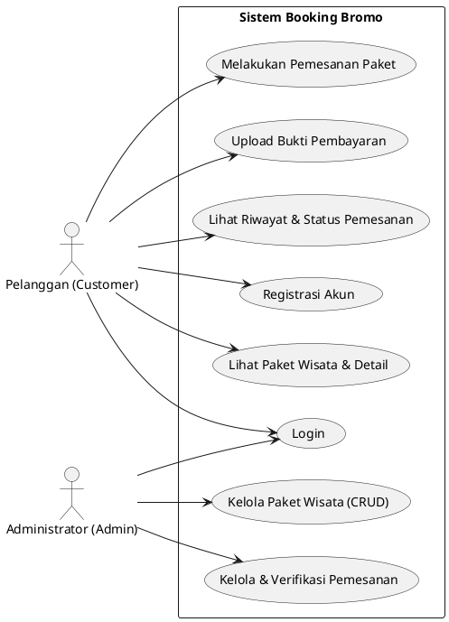
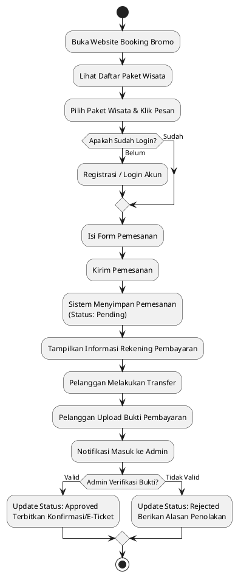
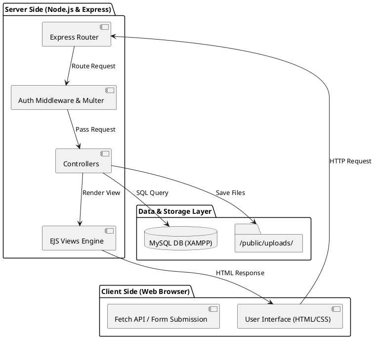
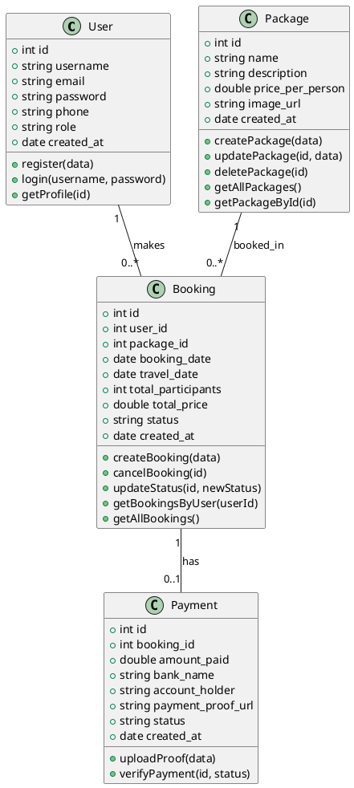
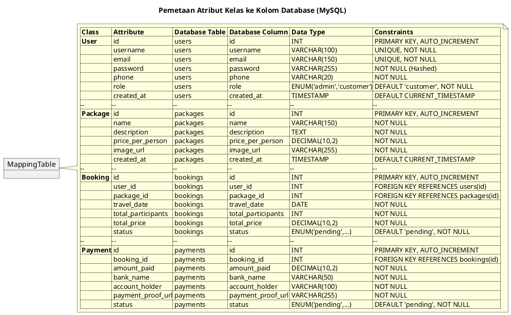
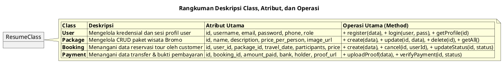
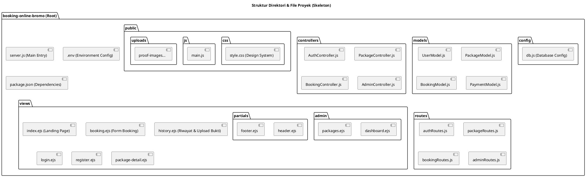
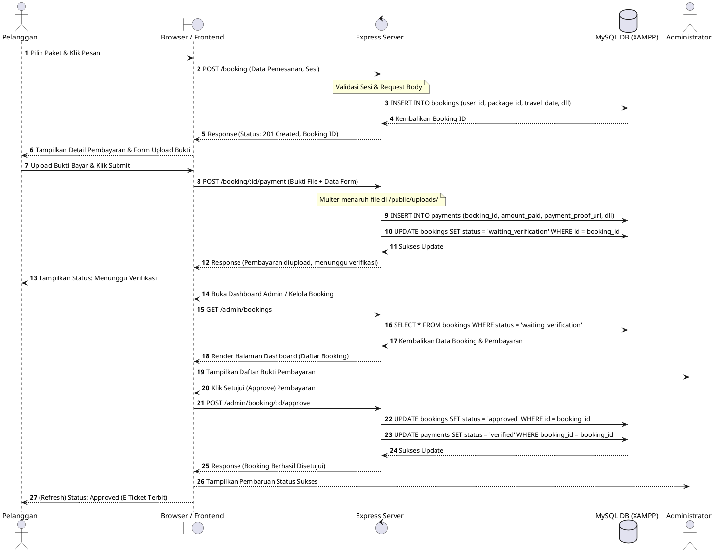
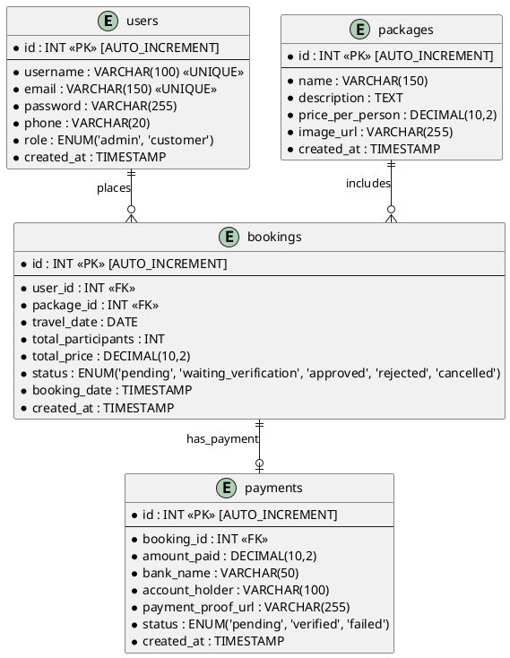

## 1. Use Case Diagram

---

## 2. Activity Diagram

---

## 3. Architecture Diagram

---

## 4. Class Diagram

---

## 5. Mapping Table (Class ke DB)

---

## 6. Resume Class, Attribute, dan Operation

---

## 7. Skeleton Kode (Struktur File Proyek)

---

## 8. Sequence Diagram

---

## 9. ERD / Database Design

