# Booking Online Bromo (Node.js & MySQL XAMPP)

Aplikasi web pemesanan tiket masuk, paket wisata, dan penyewaan Jeep Gunung Bromo berbasis **Node.js (Express, EJS, MySQL)**. Didesain dengan antarmuka bertema alam/pegunungan (Mountain Theme) yang premium, interaktif, dan responsif.

---

## Fitur Utama
1. **Otentikasi Pengguna**: Sistem registrasi & login untuk Pelanggan (Customer) dan Administrator (Admin).
2. **Katalog Paket Wisata**: Menampilkan paket default (Sunrise, Milky Way, Camping, Sewa Jeep) secara dinamis.
3. **Alur Booking Tiket**: Pilihan paket, tanggal jalan, jumlah peserta, dan kalkulasi tagihan harga otomatis.
4. **Unggah Bukti Bayar**: Pelanggan dapat mengunggah bukti transfer bank.
5. **Dashboard Administrator**:
   - Melihat ringkasan statistik pemesanan (Total, Pending, Sukses, Pendapatan Lunas).
   - Melihat detail bukti transfer dan melakukan verifikasi persetujuan (Approve/Reject).
   - Operasi CRUD (Create, Read, Update, Delete) Paket Wisata beserta upload foto paket baru.

---

## Prasyarat
- Node.js (versi 16 atau lebih baru)
- XAMPP (untuk layanan MySQL)

---

## Langkah Instalasi & Menjalankan Aplikasi

### 1. Jalankan MySQL di XAMPP
1. Buka **XAMPP Control Panel**.
2. Klik tombol **Start** pada modul **MySQL** (dan Apache jika diperlukan).

### 2. Instalasi Dependensi
Buka terminal/command prompt di direktori proyek ini (`ProjekKelompok`), lalu jalankan perintah:
```bash
npm install
```

### 3. Konfigurasi Lingkungan (`.env`)
File `.env` telah disiapkan secara otomatis dengan konfigurasi default XAMPP:
```env
PORT=3000
DB_HOST=localhost
DB_USER=root
DB_PASS=
DB_NAME=booking_bromo
SESSION_SECRET=gunung_bromo_indah_dan_megah_sekali_12345
```
*Catatan: Sistem akan mendeteksi dan membuat database `booking_bromo` beserta tabel-tabelnya secara otomatis saat aplikasi pertama kali dijalankan.*

### 4. Menjalankan Server
Jalankan aplikasi menggunakan Node.js:
```bash
npm start
```
Atau jika Anda memiliki `nodemon` terinstal secara global untuk hot-reloading:
```bash
npm run dev
```

Buka browser Anda dan akses:
👉 **[http://localhost:3000](http://localhost:3000)**

---

## Kredensial Akun Default (Seeded)

Saat aplikasi dijalankan pertama kali, sistem akan menyuntikkan data default berikut ke database Anda:

### 1. Akun Administrator
- **Username**: `admin`
- **Password**: `admin`
- **Email**: `admin@bromo.com`
- **Phone**: `081234567890`

### 2. Akun Pelanggan (Customer)
*Anda bisa langsung mendaftarkan akun baru melalui halaman **Daftar** pada website.*

---
  
## Struktur Folder Proyek
```text
ProjekKelompok/
├── config/
│   └── db.js            # Koneksi MySQL, DDL, Seeding paket & admin
├── controllers/
│   ├── AdminController.js
│   ├── AuthController.js
│   ├── BookingController.js
│   └── PackageController.js
├── models/
│   ├── BookingModel.js
│   ├── PackageModel.js
│   ├── PaymentModel.js
│   └── UserModel.js
├── public/
│   ├── css/
│   │   └── style.css    # Desain premium bertema pegunungan
│   ├── js/
│   │   └── main.js      # Interaktivitas navbar mobile
│   └── uploads/         # Direktori unggah berkas (bukti transfer & paket)
├── routes/
│   ├── adminRoutes.js
│   ├── authRoutes.js
│   ├── bookingRoutes.js
│   └── packageRoutes.js
├── views/
│   ├── admin/
│   │   ├── dashboard.ejs  # Kelola transaksi & approve bukti bayar
│   │   └── packages.ejs   # CRUD Paket wisata
│   ├── partials/
│   │   ├── footer.ejs
│   │   └── header.ejs
│   ├── booking.ejs        # Formulir pesanan tiket
│   ├── history.ejs        # Riwayat booking & upload bukti bayar
│   ├── index.ejs          # Landing page utama
│   ├── login.ejs
│   ├── package-detail.ejs # Detail deskripsi & kalkulator cepat
│   └── register.ejs
├── .env                 # Konfigurasi database & port
├── package.json         # Dependensi proyek
├── README.md            # Dokumentasi petunjuk
└── server.js            # Entry point aplikasi
```

## Tampilan Aplikasi

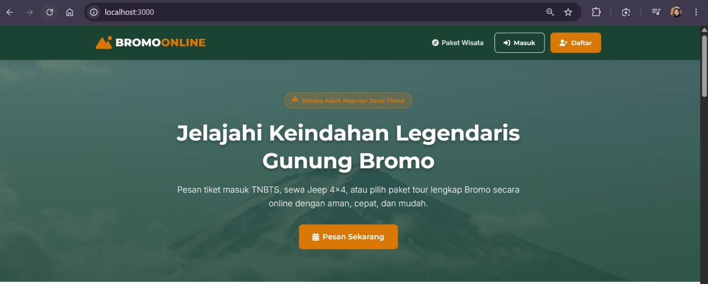

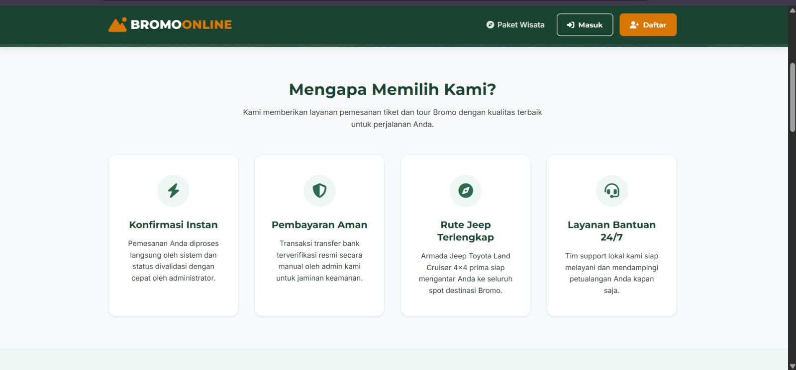

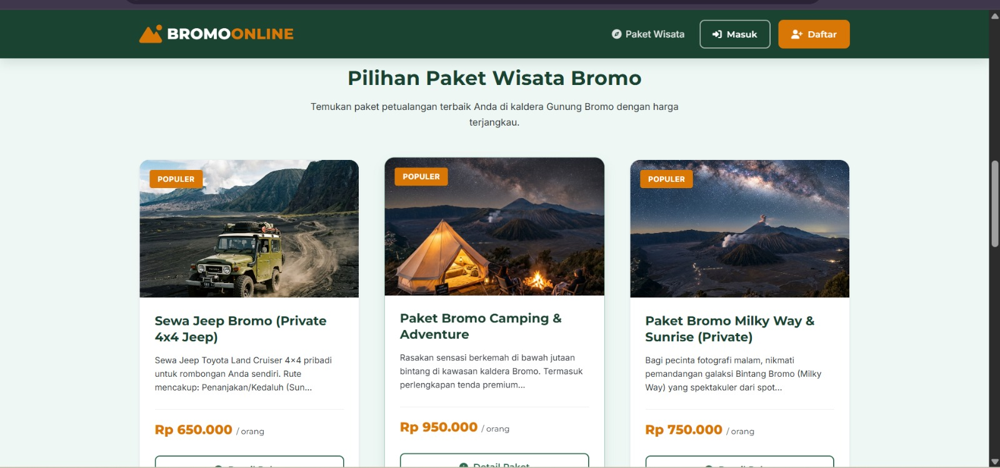

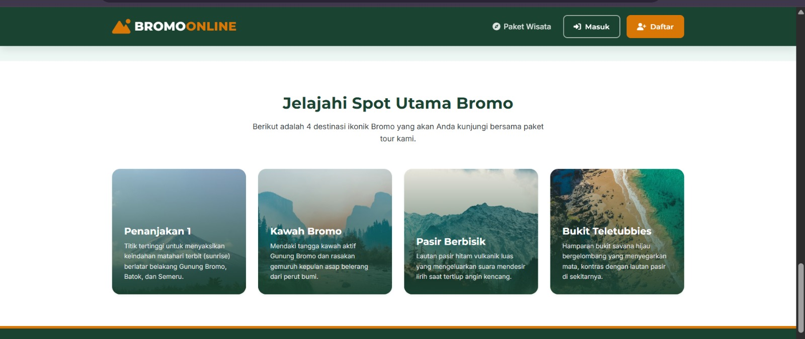

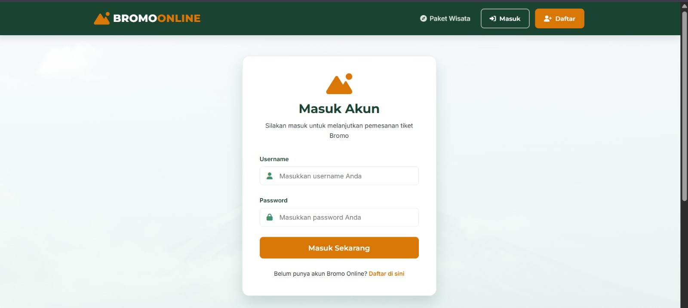

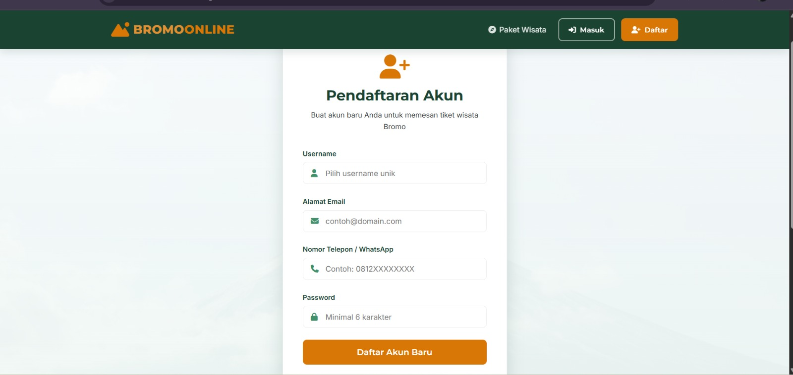

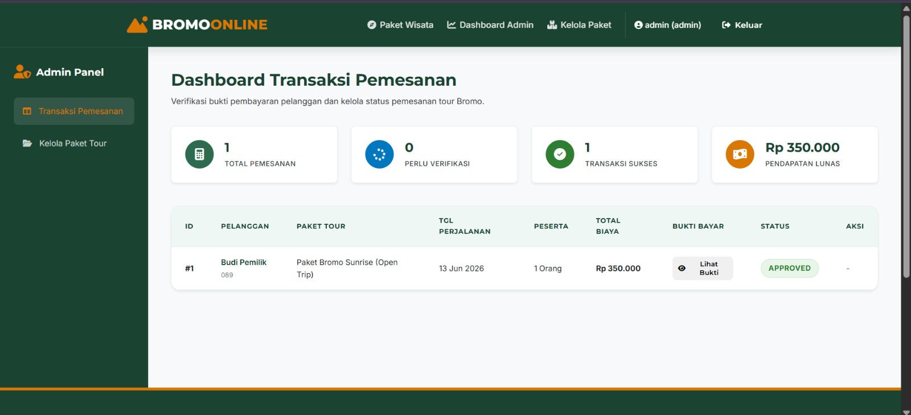

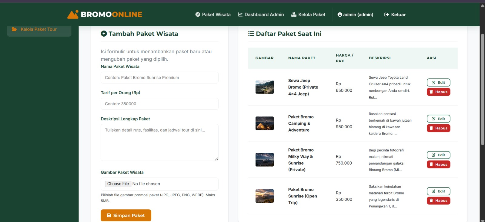

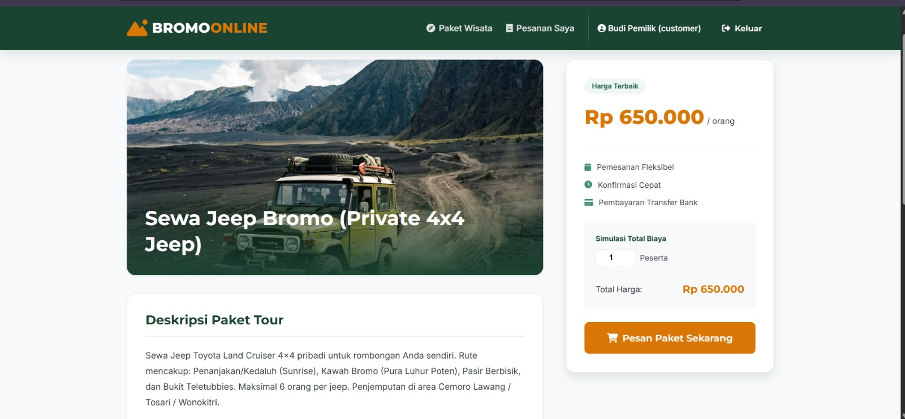

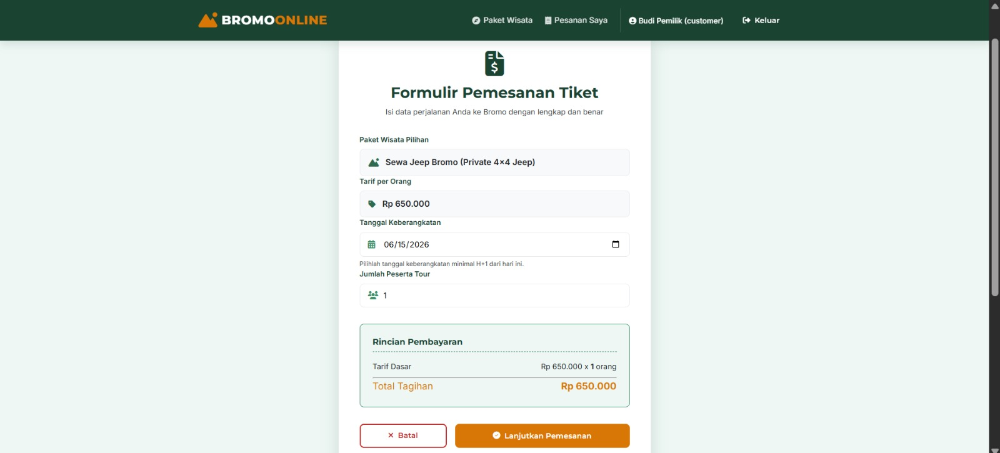

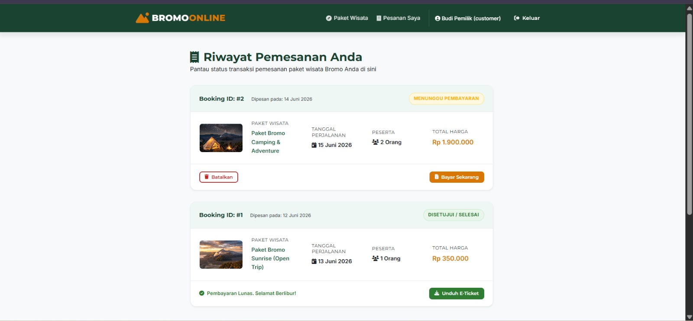

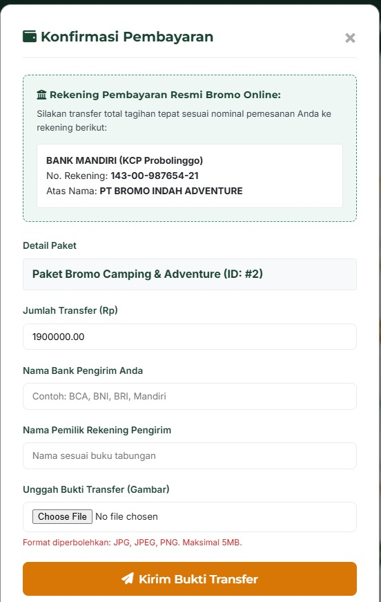
